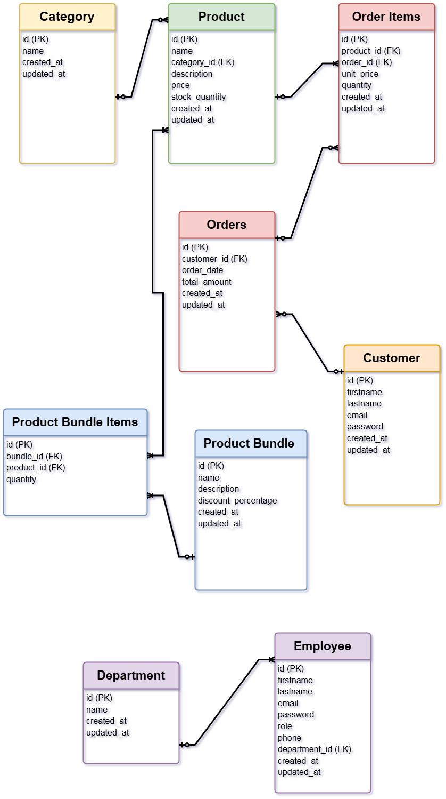

# Simple E-Commerce Database Schema

## Overview

This repository contains the schema for a simple e-commerce application. It includes the structure for categories, products, customers, employees, departments, orders, order items, and product bundles. This schema is designed to efficiently manage product listings, customer accounts, orders, employee data, and promotional bundles for an e-commerce platform.

---

## Features

- **Product Categories**: Organize products into distinct categories.
- **Customer Management**: Store and manage customer information securely.
- **Order Processing**: Track orders and their details.
- **Product Bundles**: Create and manage promotional product bundles.
- **Employee and Department Management**: Maintain records of employees and their respective departments.

---

## Database Schema

The schema defines the following tables:

1. **Category**
   - Holds product categories for the e-commerce store.
   - Attributes: `id`, `name`, `created_at`, `updated_at`

2. **Product**
   - Stores details of products available for purchase.
   - Attributes: `id`, `category_id`, `name`, `description`, `price`, `stock_quantity`, `created_at`, `updated_at`

3. **Customer**
   - Stores customer information.
   - Attributes: `id`, `firstname`, `lastname`, `email`, `password`, `created_at`, `updated_at`

4. **Order**
   - Tracks customer orders.
   - Attributes: `id`, `customer_id`, `order_date`, `total_amount`, `created_at`, `updated_at`

5. **Order Items**
   - Stores details of products ordered within each order.
   - Attributes: `id`, `order_id`, `product_id`, `quantity`, `unit_price`, `created_at`, `updated_at`

6. **Product Bundle**
   - Defines promotional bundles of products.
   - Attributes: `id`, `name`, `description`, `discount_percentage`, `created_at`, `updated_at`

7. **Product Bundle Items**
   - Links products to their respective bundles.
   - Attributes: `id`, `bundle_id`, `product_id`, `quantity`

8. **Employee**
   - Stores employee information.
   - Attributes: `id`, `firstname`, `lastname`, `email`, `password`, `role`, `phone`, `department_id`, `created_at`, `updated_at`

9. **Department**
   - Defines departments within the organization.
   - Attributes: `id`, `name`, `created_at`, `updated_at`

---

## Entity-Relationship Diagram (ERD)

The ERD visualizes the relationships between entities in the database. It includes:

- **Category**: One-to-Many with Product
- **Product**: Many-to-One with Category, Many-to-Many with Product Bundle through Product Bundle Items, One-to-Many with Order Items
- **Customer**: One-to-Many with Order
- **Order**: Many-to-One with Customer, One-to-Many with Order Items
- **Order Items**: Many-to-One with Order and Product
- **Product Bundle**: One-to-Many with Product Bundle Items
- **Product Bundle Items**: Many-to-One with Product Bundle and Product
- **Employee**: Many-to-One with Department
- **Department**: One-to-Many with Employee

## ERD (Entity-Relationship Diagram)

The ERD for this schema can be viewed below:



or

You can view the ERD diagram
[here](https://viewer.diagrams.net/?tags=%7B%7D&lightbox=1&highlight=0000ff&layers=1&nav=1#G1Lbakuuknlg39EXITW9kR2brLgfgAV7Ep)

---

## How to Use

1. **Set Up the Database**
   - Run the SQL scripts to create the database and tables.

2. **Insert Dummy Data**
   - Use the provided scripts to populate tables with sample data for testing.

3. **Run Queries**
   - Use the provided SQL queries for generating reports such as daily revenue, top-selling products, and customer orders exceeding a specific amount.

4. **Integrate with Application**
   - Use this schema as a backend database for your e-commerce application.

---

## SQL Queries

### Daily Revenue Report

```sql
SELECT
    COUNT(id) AS orders,
    SUM(o.total_amount) AS revenue
FROM
    "order" o
WHERE
    o.order_date BETWEEN '2024-01-01 00:00:00' AND '2024-01-01 23:59:59';
```

### Monthly Top-Selling Products

```sql
SELECT
    od.product_id,
    p."name",
    COUNT(od.product_id) AS total
FROM
    order_items od
INNER JOIN "order" o ON
    o.id = od.order_id
INNER JOIN product p ON
    od.product_id = p.id
WHERE
    DATE_TRUNC('month', o.order_date) = '2024-01-01'::DATE
GROUP BY
    od.product_id, p."name"
ORDER BY
    total DESC
LIMIT 10;
```

### Customers with Orders Over $500

```sql
SELECT
    c.id AS customer_id,
    (c.firstname || ' ' || c.lastname) AS fullname,
    SUM(o.total_amount) AS total_amount
FROM
    "order" o
INNER JOIN customer c ON
    o.customer_id = c.id
WHERE
    o.total_amount > 500
    AND order_date >= DATE_TRUNC('month', CURRENT_DATE) - INTERVAL '1 month'
    AND order_date < DATE_TRUNC('month', CURRENT_DATE)
GROUP BY
    c.id
ORDER BY
    total_amount DESC;
```

---

## Contributing

Contributions are welcome! Please fork the repository and submit a pull request with your changes.

---

## License

This project is licensed under the MIT License.
